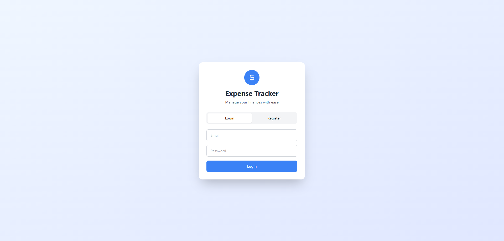
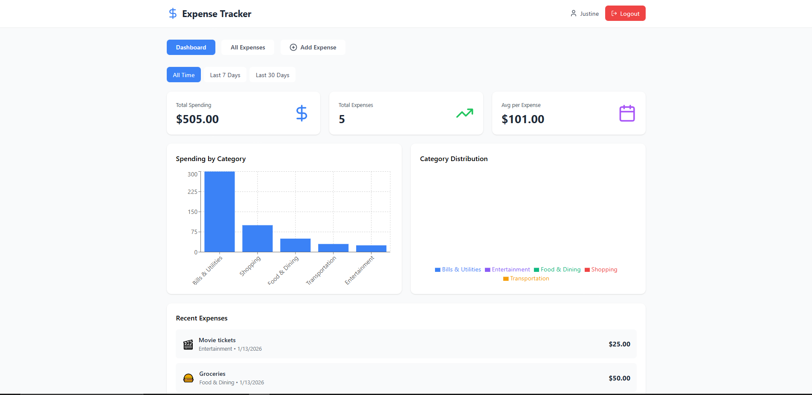
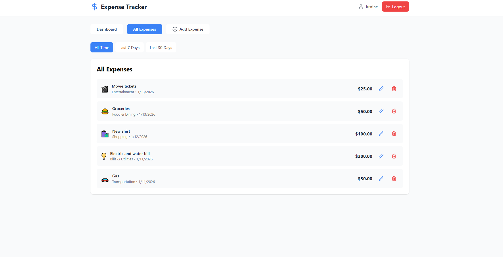

# 💰 Personal Expense Tracker

A full-stack web application for tracking personal expenses with interactive data visualizations, user authentication, and comprehensive expense management features.


## 📸 Screenshots

### Login Page


### Dashboard with Charts


### Add Expense


### Expenses List


## ✨ Features

- 🔐 **User Authentication** - Secure JWT-based authentication system
- 💵 **Expense Management** - Create, read, update, and delete expenses
- 📊 **Data Visualization** - Interactive bar charts and pie charts using Recharts
- 📱 **Responsive Design** - Works seamlessly on desktop, tablet, and mobile devices
- 🏷️ **Category Management** - Pre-defined expense categories with emoji icons
- 📅 **Date Filtering** - Filter expenses by time period (All time, Last 7 days, Last 30 days)
- 📈 **Summary Statistics** - View total spending, expense count, and averages
- 🎨 **Modern UI** - Clean and intuitive interface built with Tailwind CSS

## 🛠️ Tech Stack

### Frontend
- **React 18** - UI library for building interactive interfaces
- **Recharts** - Composable charting library for data visualization
- **Lucide React** - Beautiful icon library
- **Tailwind CSS** - Utility-first CSS framework

### Backend
- **Node.js** - JavaScript runtime environment
- **Express.js** - Web application framework
- **PostgreSQL** - Relational database management system
- **JWT** - JSON Web Tokens for authentication
- **bcrypt** - Password hashing library

### DevOps
- **Docker** - Containerization platform
- **GitHub Actions** - CI/CD automation

## 🚀 Getting Started

### Prerequisites

- Node.js 18+ ([Download](https://nodejs.org/))
- PostgreSQL 15+ ([Download](https://www.postgresql.org/download/))
- npm or yarn package manager

### Installation

1. **Clone the repository**
```bash
git clone https://github.com/Jazten56/expense-tracker.git
cd expense-tracker
```

2. **Set up the database**
```bash
# Create PostgreSQL database
createdb expense_tracker

# Or using psql
psql -U postgres
CREATE DATABASE expense_tracker;
\q
```

3. **Set up the backend**
```bash
cd backend

# Install dependencies
npm install

# Create .env file
cat > .env << EOF
DB_USER=postgres
DB_PASSWORD=your_password_here
DB_HOST=localhost
DB_PORT=5432
DB_NAME=expense_tracker
JWT_SECRET=your-super-secret-jwt-key
PORT=5000
NODE_ENV=development
EOF

# Start backend server
npm start
```

Backend will run on `http://localhost:5000`

4. **Set up the frontend**
```bash
# Open new terminal
cd frontend

# Install dependencies
npm install

# Start frontend
npm start
```

Frontend will run on `http://localhost:3000`

## 📁 Project Structure

```
expense-tracker/
├── backend/
│   ├── server.js              # Main Express server
│   ├── package.json           # Backend dependencies
│   ├── .env                   # Environment variables (not in git)
│   └── Dockerfile             # Backend Docker configuration
├── frontend/
│   ├── src/
│   │   ├── App.js             # Main React application
│   │   └── index.css          # Global styles with Tailwind
│   ├── package.json           # Frontend dependencies
│   └── Dockerfile             # Frontend Docker configuration
├── .github/
│   └── workflows/
│       └── ci-cd.yml          # GitHub Actions CI/CD pipeline
├── docker-compose.yml         # Docker orchestration
├── .gitignore                 # Git ignore rules
└── README.md                  # This file
```

## 🔧 Environment Variables

### Backend (.env)
```env
DB_USER=postgres
DB_PASSWORD=your_password
DB_HOST=localhost
DB_PORT=5432
DB_NAME=expense_tracker
JWT_SECRET=your-secret-key
PORT=5000
NODE_ENV=development
```

## 📖 API Documentation

### Authentication

#### Register User
```http
POST /api/auth/register
Content-Type: application/json

{
  "email": "user@example.com",
  "password": "password123",
  "name": "John Doe"
}
```

#### Login User
```http
POST /api/auth/login
Content-Type: application/json

{
  "email": "user@example.com",
  "password": "password123"
}
```

### Expenses (Requires Authentication)

#### Get All Expenses
```http
GET /api/expenses
Authorization: Bearer <token>
```

#### Create Expense
```http
POST /api/expenses
Authorization: Bearer <token>
Content-Type: application/json

{
  "amount": 50.00,
  "description": "Groceries",
  "category_id": 1,
  "date": "2026-01-16"
}
```

#### Update Expense
```http
PUT /api/expenses/:id
Authorization: Bearer <token>
Content-Type: application/json

{
  "amount": 60.00,
  "description": "Groceries - Updated",
  "category_id": 1,
  "date": "2026-01-16"
}
```

#### Delete Expense
```http
DELETE /api/expenses/:id
Authorization: Bearer <token>
```

#### Get Summary Statistics
```http
GET /api/expenses/summary/stats
Authorization: Bearer <token>
```

## 🎓 What I Learned

Building this project helped me develop skills in:

- **Full-stack Development** - Building complete applications from database to UI
- **RESTful API Design** - Creating scalable and maintainable API endpoints
- **Database Design** - Structuring relational databases with PostgreSQL
- **Authentication & Security** - Implementing JWT-based authentication and password hashing
- **State Management** - Managing complex application state in React
- **Data Visualization** - Creating interactive charts and graphs
- **Responsive Design** - Building mobile-friendly user interfaces
- **Version Control** - Using Git for code management
- **Docker** - Containerizing applications for consistent deployment

## 🚀 Future Enhancements

- [ ] Export data to CSV/PDF
- [ ] Receipt image upload with cloud storage
- [ ] Budget limits and alerts
- [ ] Recurring expenses
- [ ] Multi-currency support
- [ ] Email notifications
- [ ] Mobile app (React Native)
- [ ] Dark mode theme
- [ ] Expense search functionality

## 🤝 Contributing

Contributions, issues, and feature requests are welcome! Feel free to check the [issues page](https://github.com/Jazten56/expense-tracker/issues).

1. Fork the project
2. Create your feature branch (`git checkout -b feature/AmazingFeature`)
3. Commit your changes (`git commit -m 'Add some AmazingFeature'`)
4. Push to the branch (`git push origin feature/AmazingFeature`)
5. Open a Pull Request

## 📝 License

This project is [MIT](LICENSE) licensed.

## 👤 Author

**Jazten56**

- GitHub: [@Jazten56](https://github.com/Jazten56)
- Project Link: [https://github.com/Jazten56/expense-tracker](https://github.com/Jazten56/expense-tracker)

## 🙏 Acknowledgments

- [Create React App](https://create-react-app.dev/) - React application setup
- [Recharts](https://recharts.org/) - Chart library
- [Lucide](https://lucide.dev/) - Icon library
- [Tailwind CSS](https://tailwindcss.com/) - CSS framework
- [Express.js](https://expressjs.com/) - Backend framework
- [PostgreSQL](https://www.postgresql.org/) - Database

---

⭐ If you found this project helpful, please consider giving it a star!

**Built with ❤️ by Jazten56**